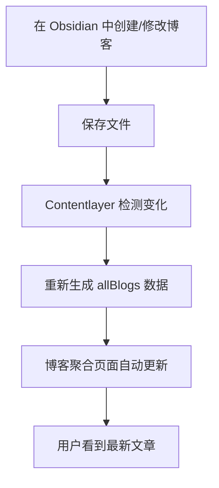

# 🔄 自动博客聚合页面解决方案

**版本**: v2.0  
**创建时间**: 2025年10月14日  
**适用范围**: DaysFromToday 项目  

## 🎯 问题分析

### **原始问题**
1. **硬编码博客列表**: 博客聚合页面使用硬编码的文章列表
2. **手动维护**: 每次新增博客都需要手动更新聚合页面
3. **维护成本高**: 容易遗漏新文章，导致聚合页面不完整

### **技术挑战**
- 如何实现博客聚合页面的自动更新？
- 如何确保新文章自动出现在列表中？
- 如何保持多语言支持？

## ✅ 解决方案

### **核心改进**
```typescript
// 之前：硬编码列表
const blogPosts = [
  { slug: 'test', title: {...}, ... },
  // 需要手动添加新文章
];

// 现在：动态获取
import { allBlogs } from '@/.contentlayer/generated';

const currentLocaleBlogs = allBlogs
  .filter(blog => blog.locale === locale)
  .sort((a, b) => new Date(b.date).getTime() - new Date(a.date).getTime());
```

### **关键特性**

#### **1. 完全自动化**
- ✅ 自动检测新文章
- ✅ 自动按日期排序（最新在前）
- ✅ 自动按语言过滤
- ✅ 自动更新文章数量统计

#### **2. 多语言支持**
- ✅ 中文页面只显示中文文章
- ✅ 英文页面只显示英文文章
- ✅ 自动本地化日期格式
- ✅ 动态文章计数

#### **3. 智能排序**
- ✅ 按发布日期降序排列
- ✅ 最新文章自动置顶
- ✅ 保持一致的显示顺序

## 🔧 技术实现

### **文件结构**
```
app/[locale]/blog/page.tsx  # 博客聚合页面
├── 动态导入 Contentlayer 数据
├── 按语言过滤文章
├── 按日期排序
└── 渲染文章列表
```

### **核心代码**
```typescript
// 1. 导入 Contentlayer 生成的数据
import { allBlogs } from '@/.contentlayer/generated';

// 2. 动态获取当前语言的博客
const currentLocaleBlogs = allBlogs
  .filter(blog => blog.locale === locale)
  .sort((a, b) => new Date(b.date).getTime() - new Date(a.date).getTime());

// 3. 渲染动态列表
{currentLocaleBlogs.map((blog) => (
  <BlogCard key={blog.slug} blog={blog} />
))}
```

## 📊 工作流程

### **自动更新流程**


### **具体步骤**
1. **内容创建**: 在 `obsidian/content/blog/zh/` 或 `obsidian/content/blog/en/` 中创建新文章
2. **自动检测**: Contentlayer 自动检测文件变化
3. **数据生成**: 重新生成 `allBlogs` 数据
4. **页面更新**: 博客聚合页面自动显示新文章
5. **排序显示**: 新文章按日期自动排序显示

## 🎉 优势总结

### **开发体验**
- ✅ **零维护**: 无需手动更新聚合页面
- ✅ **自动化**: 新文章自动出现
- ✅ **一致性**: 确保所有文章都被显示
- ✅ **实时性**: 修改后立即生效

### **用户体验**
- ✅ **完整性**: 不会遗漏任何文章
- ✅ **时效性**: 最新文章自动置顶
- ✅ **多语言**: 自动按语言分组显示
- ✅ **统计信息**: 实时显示文章数量

### **技术优势**
- ✅ **类型安全**: 使用 TypeScript 类型检查
- ✅ **性能优化**: 服务端渲染，SEO 友好
- ✅ **可扩展**: 易于添加新功能（分类、标签等）
- ✅ **维护简单**: 代码结构清晰，易于理解

## 🚀 未来扩展

### **可能的增强功能**
1. **分类过滤**: 按文章分类筛选
2. **标签系统**: 支持多标签过滤
3. **搜索功能**: 全文搜索博客内容
4. **分页支持**: 大量文章时的分页显示
5. **RSS 订阅**: 自动生成 RSS 源

### **实现建议**
```typescript
// 未来可以添加的功能
const filteredBlogs = currentLocaleBlogs
  .filter(blog => category ? blog.category === category : true)
  .filter(blog => tags ? blog.tags.some(tag => tags.includes(tag)) : true)
  .filter(blog => search ? blog.title.includes(search) || blog.description.includes(search) : true);
```

## 📝 总结

通过将硬编码的博客列表改为动态获取 Contentlayer 数据，我们实现了：

1. **完全自动化**: 新文章自动出现在聚合页面
2. **零维护成本**: 无需手动更新列表
3. **多语言支持**: 自动按语言分组
4. **智能排序**: 按日期自动排序
5. **实时更新**: 修改后立即生效

这个解决方案彻底解决了博客聚合页面的维护问题，让内容发布流程更加流畅和自动化。
