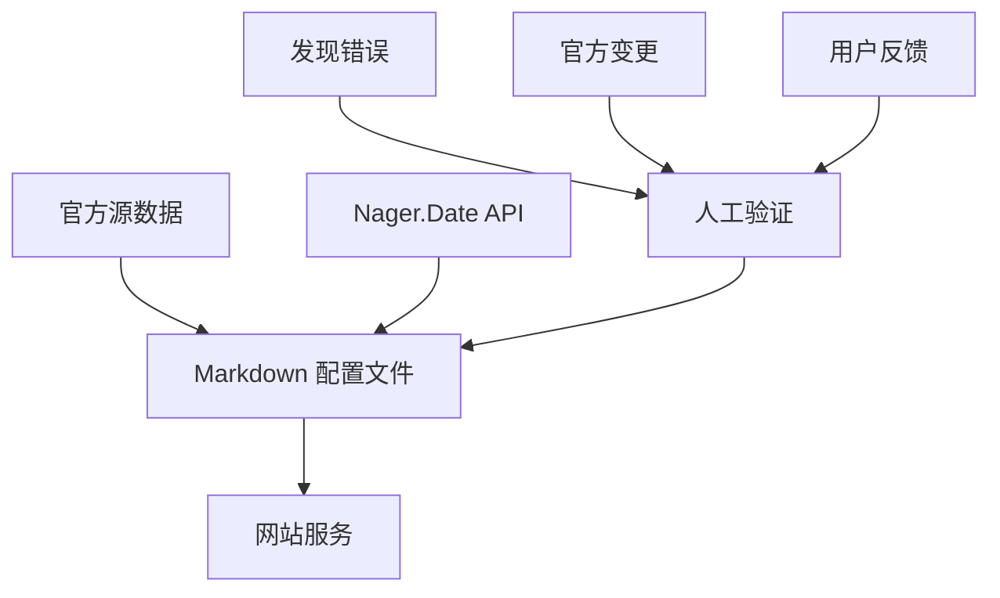

# 📅 节假日数据来源与验证指南

> **文档版本**: v1.0  
> **最后更新**: 2025-10-08  
> **维护者**: Leon  

---

## 📋 目录

- [概述](#概述)
- [数据分级策略](#数据分级策略)
- [各国官方数据源](#各国官方数据源)
- [第三方验证源](#第三方验证源)
- [数据验证流程](#数据验证流程)
- [维护指南](#维护指南)
- [常见问题](#常见问题)

---

## 📖 概述

### 🎯 目标

为 DaysFromToday 网站提供 **准确、可靠、多语言** 的节假日数据，覆盖 15 个主要国家，时间跨度为 2025-2028 年。

### 🏗️ 架构

```
数据层级：
1. 本地 Markdown 配置（优先）
   ↓ 失败时降级
2. Nager.Date API（备份）
   ↓ 失败时降级
3. 空数据（降级兜底）
```

### ✨ 核心特性

- ✅ **官方数据源**：优先使用各国政府官方发布的节假日数据
- ✅ **人工验证**：所有数据经过人工对照验证
- ✅ **双语支持**：维护英文和中文名称
- ✅ **高性能**：本地配置，响应速度 <5ms
- ✅ **易维护**：Markdown 格式，易于编辑和版本管理

---

## 🏆 数据分级策略

### 数据源等级定义

| 等级 | 说明 | 准确性 | 更新频率 | 应用 |
|-----|------|--------|---------|------|
| **⭐⭐⭐⭐⭐ 官方政府源** | 国家政府机构官方发布 | 99%+ | 年度/及时 | Tier 1 国家 |
| **⭐⭐⭐⭐ 半官方源** | 央行、劳工部等权威机构 | 95%+ | 年度/及时 | Tier 1 & 2 |
| **⭐⭐⭐ 第三方验证源** | Nager.Date (开源社区验证) | 85-90% | 年度 | 初始化数据 |
| **⭐⭐ 商业数据源** | TimeAndDate.com 等 | 80-85% | 延迟 | 不使用 |

### 国家分级

#### **Tier 1 国家（5个）** - 官方源 + 人工验证

优先级最高，数据准确性要求 95%+

1. 🇨🇳 中国 (China)
2. 🇺🇸 美国 (United States)
3. 🇬🇧 英国 (United Kingdom)
4. 🇯🇵 日本 (Japan)
5. 🇩🇪 德国 (Germany)

#### **Tier 2 国家（10个）** - API初始化 + 逐步验证

初期使用 API 数据，逐步人工验证

6. 🇫🇷 法国 (France)
7. 🇨🇦 加拿大 (Canada)
8. 🇦🇺 澳大利亚 (Australia)
9. 🇮🇳 印度 (India)
10. 🇧🇷 巴西 (Brazil)
11. 🇲🇽 墨西哥 (Mexico)
12. 🇮🇹 意大利 (Italy)
13. 🇪🇸 西班牙 (Spain)
14. 🇸🇬 新加坡 (Singapore)
15. 🇦🇪 阿联酋 (UAE)

---

## 🌍 各国官方数据源

### Tier 1 国家详细数据源

#### 1. 🇨🇳 中国 (China)

**官方数据源：**
- **国务院办公厅官网**
  - URL: http://www.gov.cn/zhengce/
  - 具体通知示例：《国务院办公厅关于2025年部分节假日安排的通知》
  - 发布时间：通常每年 10-11 月发布次年安排

**权威性：** ⭐⭐⭐⭐⭐

**特点：**
- 包含详细的调休安排
- 说明节假日是否与周末连休
- 法定假期最权威来源
- 中文官方原文

**更新方式：**
- 每年 10-11 月人工从官网复制
- 转换为 Markdown 格式
- 添加中英文对照

**数据示例：**
```markdown
### 春节 | Spring Festival
- **日期**: 2025-01-29 ~ 2025-02-04
- **类型**: 公共假期 (Public Holiday)
- **全国性**: 是
- **说明**: 农历新年，法定假期7天，1月26日（周日）、2月8日（周六）上班
```

---

#### 2. 🇺🇸 美国 (United States)

**官方数据源：**

1. **联邦储备委员会 (Federal Reserve)**
   - URL: https://www.federalreserve.gov/aboutthefed/k8.htm
   - 说明：联邦银行假期官方列表

2. **美国人事管理办公室 (OPM)**
   - URL: https://www.opm.gov/policy-data-oversight/pay-leave/federal-holidays/
   - 说明：联邦政府雇员假期

**权威性：** ⭐⭐⭐⭐⭐

**特点：**
- 联邦假期规则固定（如 Memorial Day = 5月最后一个周一）
- 未来 10 年可预测
- 各州可能有额外假期（我们仅采用联邦假期）

**计算规则：**
```
- New Year's Day: 1月1日
- Martin Luther King Jr. Day: 1月第3个周一
- Presidents' Day: 2月第3个周一
- Memorial Day: 5月最后一个周一
- Independence Day: 7月4日
- Labor Day: 9月第1个周一
- Columbus Day: 10月第2个周一
- Veterans Day: 11月11日
- Thanksgiving Day: 11月第4个周四
- Christmas Day: 12月25日
```

**更新方式：**
- 使用算法自动计算（基于规则）
- 官网验证
- 每年验证一次

---

#### 3. 🇬🇧 英国 (United Kingdom)

**官方数据源：**
- **英国政府官网**
  - URL: https://www.gov.uk/bank-holidays
  - JSON API: https://www.gov.uk/bank-holidays.json

**权威性：** ⭐⭐⭐⭐⭐

**特点：**
- 直接提供 JSON API 接口
- 包含英格兰、苏格兰、威尔士、北爱尔兰的差异
- 数据可直接抓取
- 官方维护，及时更新

**API 响应示例：**
```json
{
  "england-and-wales": {
    "division": "england-and-wales",
    "events": [
      {
        "title": "New Year's Day",
        "date": "2025-01-01",
        "notes": "",
        "bunting": true
      }
    ]
  }
}
```

**更新方式：**
- 自动抓取官方 API
- 人工验证日期
- 添加中文翻译

---

#### 4. 🇯🇵 日本 (Japan)

**官方数据源：**

1. **内阁府官网**
   - URL: https://www8.cao.go.jp/chosei/shukujitsu/gaiyou.html
   - 说明：日本国家节假日官方说明

2. **祝日法规**
   - URL: https://elaws.e-gov.go.jp/
   - 说明：日本法律电子政务总合窗口

**权威性：** ⭐⭐⭐⭐⭐

**特点：**
- 节假日由《国民の祝日に関する法律》（国民祝日法）规定
- 包含"振替休日"（补休）逻辑
- 可能因皇室事件临时调整
- 需人工从日文网站提取

**复杂规则：**
```
- 如果节假日落在周日，次日（周一）自动成为补休日
- 两个节假日之间只有1个工作日时，该日也成为假期（"夹日"规则）
```

**更新方式：**
- 人工从官网提取
- 使用 Nager.Date API 交叉验证
- 计算振替休日

---

#### 5. 🇩🇪 德国 (Germany)

**官方数据源：**

1. **联邦内政部 (BMI)**
   - URL: https://www.bmi.bund.de/
   - 说明：联邦内政与国土安全部

2. **各州文化部**
   - 说明：德国各州有不同的节假日

**权威性：** ⭐⭐⭐⭐

**特点：**
- 16 个联邦州有不同假期
- 我们采用"全德共有假期"
- 复活节等移动假期需计算

**全德共有节假日：**
```
- Neujahr (New Year's Day): 1月1日
- Karfreitag (Good Friday): 复活节前的周五
- Ostermontag (Easter Monday): 复活节后的周一
- Tag der Arbeit (Labour Day): 5月1日
- Christi Himmelfahrt (Ascension Day): 复活节后39天
- Pfingstmontag (Whit Monday): 复活节后50天
- Tag der Deutschen Einheit (German Unity Day): 10月3日
- 1. Weihnachtsfeiertag (Christmas Day): 12月25日
- 2. Weihnachtsfeiertag (Boxing Day): 12月26日
```

**更新方式：**
- 使用复活节算法计算移动假期
- 官网验证
- Nager.Date API 交叉验证

---

### Tier 2 国家数据源

| 国家 | 官方数据源 | 权威性 | 备注 |
|-----|-----------|--------|------|
| 🇫🇷 **法国** | [Service-Public.fr](https://www.service-public.fr/particuliers/vosdroits/F2405) | ⭐⭐⭐⭐ | 政府服务门户，法定假期 |
| 🇨🇦 **加拿大** | [Canada.ca](https://www.canada.ca/en/revenue-agency/services/tax/public-holidays.html) | ⭐⭐⭐⭐ | 税务局官方，联邦假期 |
| 🇦🇺 **澳大利亚** | [Australia.gov.au](https://www.australia.gov.au/about-australia/special-dates-and-events/public-holidays) | ⭐⭐⭐⭐ | 政府门户，各州差异较大 |
| 🇮🇳 **印度** | [IndiaCode](https://www.indiacode.nic.in/) | ⭐⭐⭐ | 各邦差异极大，仅采用全国性假期 |
| 🇧🇷 **巴西** | [Planalto.gov.br](http://www.planalto.gov.br/) | ⭐⭐⭐⭐ | 总统府官网，联邦假期 |
| 🇲🇽 **墨西哥** | [STPS](https://www.gob.mx/stps) | ⭐⭐⭐⭐ | 劳工和社会福利部 |
| 🇮🇹 **意大利** | [Italia.it](https://www.italia.it/en/useful-info/public-holidays.html) | ⭐⭐⭐⭐ | 旅游局官方信息 |
| 🇪🇸 **西班牙** | [BOE.es](https://www.boe.es/) | ⭐⭐⭐⭐ | 官方公报 (Boletín Oficial del Estado) |
| 🇸🇬 **新加坡** | [MOM Singapore](https://www.mom.gov.sg/employment-practices/public-holidays) | ⭐⭐⭐⭐⭐ | 人力部官方，数据准确 |
| 🇦🇪 **阿联酋** | [U.AE Portal](https://u.ae/en/information-and-services/public-holidays-and-religious-affairs/public-holidays) | ⭐⭐⭐ | 伊斯兰历法节日需估算 |

---

## 🔧 第三方验证源

### Nager.Date API

**官网：** https://date.nager.at/  
**GitHub：** https://github.com/nager/Nager.Date  
**API 文档：** https://date.nager.at/swagger/index.html

#### 特点

- ✅ 开源项目，社区维护
- ✅ 覆盖 120+ 国家
- ✅ 每年更新
- ✅ 单元测试覆盖
- ✅ 数据源文档化
- ✅ 免费 API，无需认证

#### API 使用示例

```bash
# 获取 2025 年中国节假日
curl https://date.nager.at/api/v3/PublicHolidays/2025/CN

# 响应示例
[
  {
    "date": "2025-01-01",
    "localName": "元旦",
    "name": "New Year's Day",
    "countryCode": "CN",
    "fixed": true,
    "global": true,
    "counties": null,
    "launchYear": null,
    "types": ["Public"]
  }
]
```

#### 限制

- ⚠️ 非官方数据，可能有延迟或错误
- ⚠️ 宗教节日（如伊斯兰节日）可能不准确
- ⚠️ 部分国家数据更新不及时
- ⚠️ 仅提供英文名称，需人工添加中文

#### 使用策略

```
1. 用于初始化数据（自动抓取）
2. 作为官方源的交叉验证
3. 填补无官方源的国家数据
4. 定期更新时的参考
```

---

## ✅ 数据验证流程

### 三层验证机制



### 验证步骤

#### 阶段 1：数据初始化（自动）

```bash
# 运行数据生成脚本
npm run holidays:init

# 输出结果
✅ CN.md - 已生成 (来源: Nager.Date API)
✅ US.md - 已生成 (来源: Nager.Date API)
✅ GB.md - 已生成 (来源: Gov.uk API)
...
⚠️  所有数据标记为"待验证"
```

#### 阶段 2：人工验证（手工）

**Tier 1 国家（优先）：**

1. **打开对应国家的 Markdown 文件**
   ```bash
   vim data/holidays/CN.md
   ```

2. **对照官方源验证每个节假日**
   - 日期是否正确
   - 名称是否准确
   - 类型是否合适
   - 是否有遗漏

3. **添加中文翻译**
   - 确保翻译符合习惯
   - 保留官方术语

4. **补充说明**
   ```markdown
   ### 春节 | Spring Festival
   - **日期**: 2025-01-29 ~ 2025-02-04
   - **说明**: 农历新年，法定假期7天
     - 调休安排：1月26日（周日）、2月8日（周六）上班
     - 高速公路免费：1月28日 00:00 - 2月4日 24:00
   ```

5. **更新元数据**
   ```markdown
   > **维护状态**: ✅ 已人工验证  
   > **验证者**: Leon  
   > **验证日期**: 2025-10-08  
   ```

#### 阶段 3：持续维护（年度）

**时间表：**

| 时间 | 任务 | 优先级 |
|-----|------|--------|
| **每年 10 月** | 关注各国官方发布次年节假日 | 高 |
| **每年 11 月** | 更新 Tier 1 国家数据 | 高 |
| **每年 12 月** | 更新 Tier 2 国家数据 | 中 |
| **按需** | 修复用户报告的错误 | 高 |
| **每季度** | 验证未来2年数据准确性 | 低 |

---

## 📝 维护指南

### 如何添加新国家节假日

**示例：添加 2026 年中国节假日**

1. **查找官方源**
   - 访问国务院办公厅官网
   - 找到《关于2026年部分节假日安排的通知》

2. **编辑 Markdown 文件**
   ```bash
   vim data/holidays/CN.md
   ```

3. **添加新年份数据**
   ```markdown
   ## 2026年

   ### 元旦 | New Year's Day
   - **日期**: 2026-01-01, 2026-01-02, 2026-01-03
   - **类型**: 公共假期 (Public Holiday)
   - **全国性**: 是
   - **说明**: 法定节假日，调休3天

   ### 春节 | Spring Festival
   - **日期**: 2026-02-17 ~ 2026-02-23
   - **类型**: 公共假期 (Public Holiday)
   - **全国性**: 是
   - **说明**: 农历新年，法定假期7天
   ```

4. **更新元数据**
   ```markdown
   > **最后更新**: 2025-11-15  
   > **维护状态**: ✅ 2025-2026 已验证，2027-2028 待官方公布  
   ```

5. **本地测试**
   ```bash
   npm run dev
   # 访问 http://localhost:3000/zh/holidays
   # 验证数据显示正确
   ```

6. **提交代码**
   ```bash
   git add data/holidays/CN.md
   git commit -m "feat: 添加 2026 年中国节假日数据"
   git push origin main
   ```

### 如何修复数据错误

**示例：修正日期错误**

1. **识别错误**
   - 用户反馈或自行发现
   - 例如：春节日期错误

2. **查找对应文件**
   ```bash
   vim data/holidays/CN.md
   ```

3. **修改错误数据**
   ```markdown
   # 修改前
   - **日期**: 2026-02-17 ~ 2026-02-23

   # 修改后
   - **日期**: 2026-02-18 ~ 2026-02-24
   ```

4. **记录变更**
   ```markdown
   ## 维护日志

   - **2025-10-08**: 初始化数据，来源 API + 国务院网站
   - **2025-10-15**: 修正 2026 年春节日期（根据官方通知）✅
   ```

5. **立即部署**
   ```bash
   git add data/holidays/CN.md
   git commit -m "fix: 修正 2026 年春节日期"
   git push origin main
   # Vercel 自动部署，1分钟内生效
   ```

---

## ❓ 常见问题

### Q1: 为什么不完全依赖 Nager.Date API？

**答：** 
- ❌ API 数据可能有延迟或错误
- ❌ 仅提供英文，无中文支持
- ❌ 网络请求慢（200-1000ms）
- ❌ 无法自行修复错误
- ✅ 本地配置快速可靠（<5ms）

### Q2: 移动假期（如复活节）如何处理？

**答：**
- 使用 Computus 算法预计算
- 官方源验证
- 人工确认准确性

### Q3: 伊斯兰节日如何处理？

**答：**
- 基于伊斯兰历，需观月确定
- 提前2年数据为"预测值"
- 标注 `⚠️ 待官方确认`
- 每年更新确认

### Q4: 如何处理各州/省差异？

**答：**
- 仅显示"全国性节假日"
- 标注 `🌍 全国` vs `📍 地区`
- 未来可添加地区筛选器

### Q5: 数据多久更新一次？

**答：**
- **Tier 1 国家**：每年11月更新次年数据
- **Tier 2 国家**：每年12月更新
- **错误修复**：发现后立即修复

---

## 📊 数据质量报告

### 当前状态（2025-10-08）

| 国家 | 2025 | 2026 | 2027 | 2028 | 验证状态 |
|-----|------|------|------|------|---------|
| 🇨🇳 中国 | ✅ | ⏳ | ⏳ | ⏳ | 待初始化 |
| 🇺🇸 美国 | ⏳ | ⏳ | ⏳ | ⏳ | 待初始化 |
| 🇬🇧 英国 | ⏳ | ⏳ | ⏳ | ⏳ | 待初始化 |
| 🇯🇵 日本 | ⏳ | ⏳ | ⏳ | ⏳ | 待初始化 |
| 🇩🇪 德国 | ⏳ | ⏳ | ⏳ | ⏳ | 待初始化 |
| 其他10国 | ⏳ | ⏳ | ⏳ | ⏳ | 待初始化 |

**图例：**
- ✅ 已验证
- ⏳ 待验证
- ❌ 数据缺失

---

## 🔗 相关链接

- [项目 GitHub](https://github.com/yourusername/daysfromtoday)
- [Nager.Date GitHub](https://github.com/nager/Nager.Date)
- [数据维护指南](./HOLIDAYS_MAINTENANCE.md)

---

**最后更新：** 2025-10-08  
**维护者：** Leon  
**反馈邮箱：** leeleon2020@gmail.com

